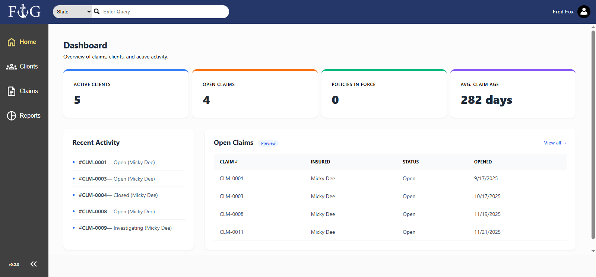
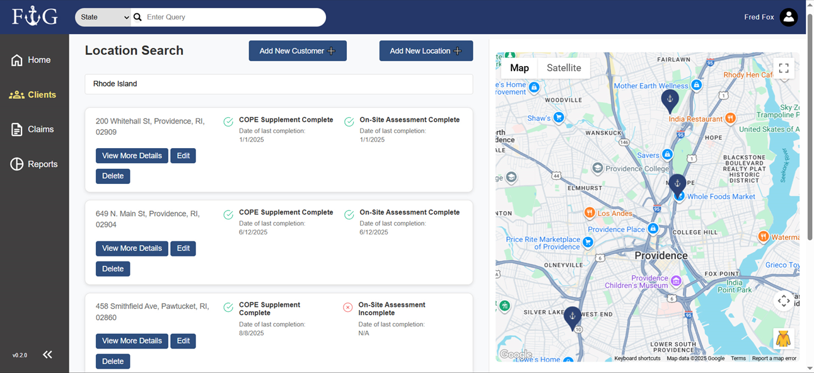
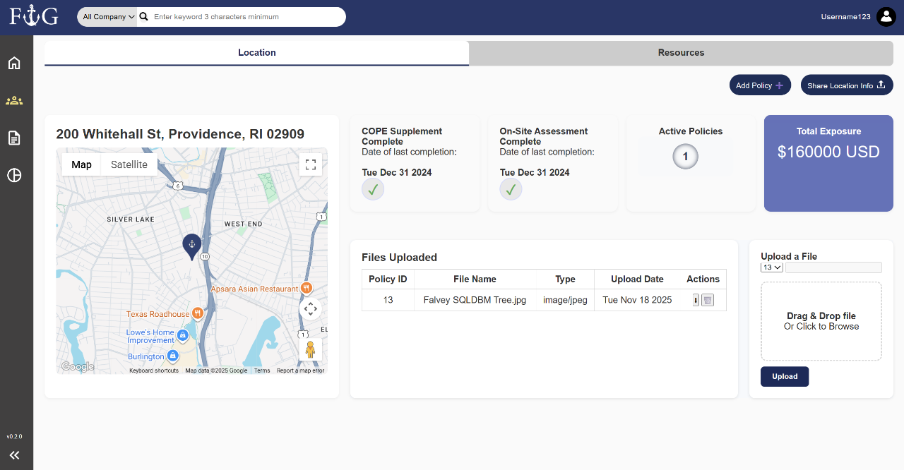

# Insurance Client Management Portal

This project is a full-stack client management web application built for an insurance company as a Rhode Island College Software Engineering Capstone Project. It allows users to efficiently manage:
- Clients
- Insurance Policies
- Claims
- Announcements
- Internal Memos
- Recommendations
- Uploaded Resources (images, PDFs, text documents)

The application also includes:

- Interactive Google Maps integration for client location searches
- Dynamic dashboard
- Secure authentication with session tracking and audit logging
- Responsive user interface

# Team Members

| Member | Responsibilities |
|---------|------------------|
| **Daniel (Repo Owner)** | Project management, backend architecture, database mapping, front-back connectivity, navbar search, file uploads |
| **An** | Sign In/Up frontend, Resources page, Claims modal |
| **Edwin** | Client Location page, Google Maps integration, filtering, sorting |
| **Jacob** | Release Notes page, ReleasesController, Login HTML |
| **Marten** | Dashboard, Login UI, Claims page, database design |
| **Oswald** | Technical design, backend APIs, Map backend/frontend, Session Settings |
| **Oswin** | Authentication, Sessions, Login Audit, frontend session validation |

## Features

* Google Maps integration for customer locations
* Navigation search by state or location ID
* File upload and document management
* Customer and location record management
* Insurance policy tracking
* Internal memos and recommendations
* Secure account authentication with session tracking
* Dynamic dashboard for client and account information
* Company announcements and shared resources

## Project Demo

The repository includes screenshots and video recordings that demonstrate the portal's interface and core workflows without requiring visitors to configure and run the application locally.

### Demo Images

The [`demo_images`](./demo_images) folder contains screenshots of the application's dashboard, location search, and client management features. These images provide a quick visual overview of the user interface and can be viewed directly through GitHub.







### Demo Videos

The [`demo_videos`](./demo_videos) folder contains recordings that demonstrate interactive features. These videos allow visitors to see how users navigate the portal, search for client information, and interact with its management tools.

[Client Management Page Functionality](./demo_videos/Client_Page_Tour.mp4)

[Location Search - Add Customer & Location Functionality](./demo_videos/Map_Add.mp4)

[Search Bar Functionality by State & Location ID](./demo_videos/Search_Bar.mp4)


## Tech Stack

### Frontend

* HTML5
* CSS3
* JavaScript
* Fetch API

### Backend

* C#
* ASP.NET Core Web API
* Entity Framework Core
* Role-based authorization

### Database and Integrations

* MySQL
* Google Maps API

### Development Tools

* Visual Studio
* Swagger / OpenAPI
* MySQL Workbench
* Git and GitHub

## Project Structure

```text
FalveyInsuranceGroup/
├── Backend/
│ ├── Controllers/     API controllers and endpoint logic
│ └── Dtos/            API request and response models
│ ├── Filters/         Input field validation check
│ ├── Models/          Application and database entities
│ └── Services/        Reusable logic for API controllers
├── Db/                MySQL database resources and application database context
├── demo_images        Contains images of the portal in use
├── demo_videos        Contains videos of the portal in use
├── Sql/               SQL scripts and database-related resources
├── wwwroot/           Stores JavaScript, CSS, images, and other static files
├── Program.cs         Application configuration
└── appsettings.json   Application and database settings
```

## Getting Started

### Prerequisites

To run locally, you will need:

* .NET 9 SDK
* MySQL Workbench 8
* Google Maps API key (optional, for map functionality)
* A modern web browser
* Git

### Installation

1. Clone the repository:

```bash
git clone https://github.com/ddibiasio2952/InsuranceClientManagementPortal.git
```

2. Import the database backup file

Import Dump20251129 (2).sql from InsuranceClientManagementPortal\Db


3. Update the database connection string in `appsettings.json`:

```json
{
  "ConnectionStrings": {
    "DefaultConnectionString": "Your SQL Server connection string"
  }
}
```

4. Start the application:

```bash
dotnet run
```

5. Open the local HTTPS URL displayed in the terminal.

The exact port may differ depending on the development environment.

6. Log In
   
You can log in with the following account:
* email: domminnow@emailplace.com, password: domminnow

## API Documentation

When the application is running in the development environment, Swagger can be used to inspect and test the available API endpoints.

Navigate to:

```text
https://localhost:<port>/swagger
```

Some endpoints require an authenticated account or a specific Identity role.

## Project Status

Insurance Client Management Portal development is closed.

## Purpose

This application was created as a software engineering capstone project for an external client. It demonstrates collaborative development, project planning, relational data modeling, full-stack ASP.NET Core development, API integration, authentication, and frontend/backend communication.

* Full-stack web development
* REST API design
* Authentication and authorization
* Relational database design
* Entity Framework Core
* Asynchronous JavaScript
* Client-server communication
* Input validation and error handling

## License

All rights reserved.

This repository is provided for portfolio and demonstration purposes. The source code may be viewed, but it may not be copied, modified, redistributed, or used in another project without permission.

### Contributing Author
Daniel DiBiasio

[GitHub](https://github.com/ddibiasio2952/)
